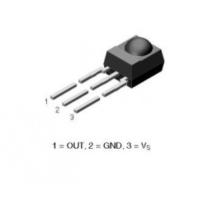
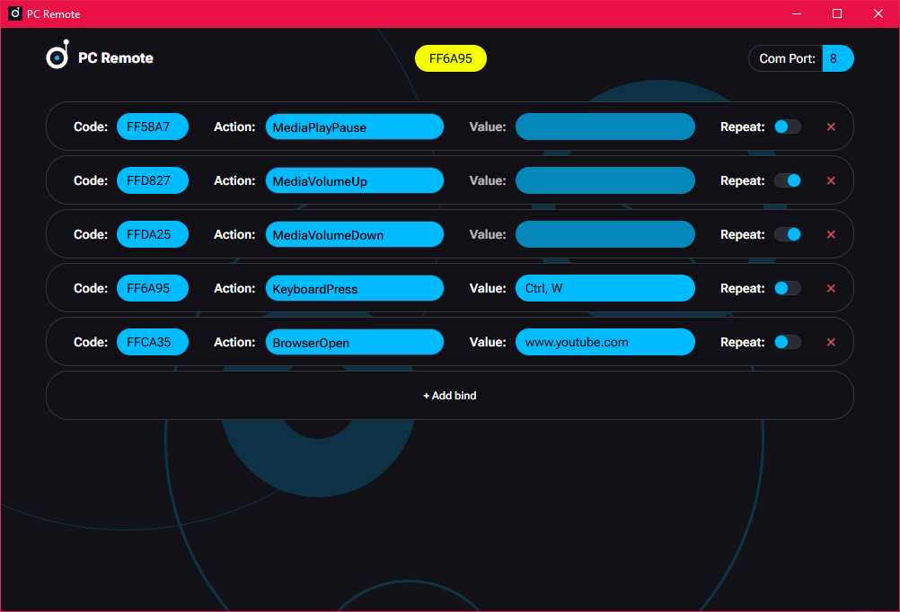

# PC Remote

PC Remote is a computer remote control system based on an Arduino Nano microcontroller and a TSOP4838 IR receiver. The Arduino board reads signals from a standard IR remote control. A Rust-based application on your PC receives these signals via the board's COM port and executes user-defined actions.

The application provides a graphical interface for managing button bindings, assigning actions, and configuring behavior. You must also specify the COM port number for the Arduino board within the application.

> **Download for Windows**: [Release v0.1.0](https://github.com/fuderis/pc-remote/raw/main/pc-remote.zip)

## Features:

* **Control your PC** with any IR remote
* **Flexible bindings**: Assign custom actions to remote buttons
* **User-friendly interface**: Manage all settings and bindings visually
* **Cross-platform**: Works wherever Rust and Arduino Nano are supported

## Getting Started:

### 1. Soldering the IR Receiver to Arduino Nano

Connect the TSOP4838 IR receiver to your Arduino Nano as follows:

* *VCC* (receiver) → *5V* (Nano)
* *GND* (receiver) → *GND* (Nano)
* *OUT* (receiver) → *D2* (Nano)

> Ensure all connections are solid and insulated.

### 2. Flashing the Arduino Nano

1. Download and install the [Arduino IDE](https://www.arduino.cc/en/software/).
2. Install the library '**IRremote**' (__*2.6.0* - *2.8.0*__).
3. Open the sketch from [/sketch in my repository](https://github.com/fuderis/pc-remote/tree/main/sketch).
4. Connect your Arduino Nano to your PC via USB.
5. Select the correct board and COM port in the Arduino IDE.
6. Upload the sketch to your Arduino Nano.

### 3. Downloading the PC Remote Software

1. Download the latest release of the [PC Remote](https://github.com/fuderis/pc-remote/raw/main/pc-remote.zip) application.
2. Unzip the archive to a convenient location on your PC and install it.
3. Run the executable file to start the interface.

### 4. Configuring Bindings and Actions

> On first launch, specify the COM port number where your Arduino Nano is connected (e.g.: COM3).

Use the graphical interface to add or edit button bindings:

1. Press a button on your IR remote to register its code.
2. Press the '*Add bind*' button to create new bind with the previously pressed code.
3. Assign an action from the available list.
4. If the 'Value' field is available, then fill it in:
    * *KeyboardPress*: write names of the keys separated by commas
    * *BrowserOpen*: write website URL-address
5. You can enable button press repeating if you need.

#### Available Actions:

| Identifier	        | Description                                                                                       |
| --------------------- | ------------------------------------------------------------------------------------------------- |
| KeyboardPress	        | Keyboard key press (single key or key combinations, including modifiers like Ctrl, Alt, Shift)    |
| BrowserOpen	        | Open a website at the specified URL in your default browser                                       |
| MediaSwitchDevice	    | Switch the active audio output device (for example, between speakers and headphones)              |
| MediaPlayPause	    | Toggle media playback (play or pause current track or video)                                      |
| MediaNextTrack	    | Skip to the next media track                                                                      |
| MediaPrevTrack	    | Return to the previous media track                                                                |
| MediaStop	            | Stop media playback completely                                                                    |
| MediaMuteUnmute	    | Toggle mute state for system audio                                                                |
| MediaVolumeUp	        | Increase system volume                                                                            |
| MediaVolumeDown	    | Decrease system volume                                                                            |
| MouseOnOff	        | Enable or disable mouse control mode with the remote                                              |
| MouseLeft	            | Move the mouse cursor left                                                                        |
| MouseRight	        | Move the mouse cursor right                                                                       |
| MouseUp	            | Move the mouse cursor up                                                                          |
| MouseDown	            | Move the mouse cursor down                                                                        |
| MouseClick	        | Perform a left mouse button click                                                                 |
| MouseScrollUp	        | Scroll up using the mouse wheel                                                                   |
| MouseScrollDown	    | Scroll down using the mouse wheel                                                                 |
| BrowserOpenNewTab	    | Open a new tab in the default browser                                                             |
| BrowserReopenTab	    | Reopen the last closed browser tab                                                                |
| BrowserSwitchTab	    | Switch to the next browser tab                                                                    |
| BrowserCloseTab	    | Close the current browser tab                                                                     |
| BrowserHistoryBack	| Go back to the previous page in browser history                                                   |
| BrowserHistoryForward	| Go forward to the next page in browser history                                                    |
| BrowserBookmarkPage	| Add the current page to bookmarks                                                                 |
| BrowserZoomIn	        | Zoom in (increase page scale) in the browser                                                      |
| BrowserZoomOut	    | Zoom out (decrease page scale) in the browser                                                     |
| WindowsExit	        | Log out the current Windows user session                                                          |
| WindowsSleep	        | Put the computer into sleep mode                                                                  |
| WindowsPowerOff	    | Shut down the computer                                                                            |
| WindowsSwitchTab	    | Switch between open applications (similar to Alt+Tab)                                             |

#### Supported Keyboard Keys:

| Type                  | Key	                                                                                                |
| --------------------- | ----------------------------------------------------------------------------------------------------- |
| Symbols               | +, -, =, *, /, and etc.                                                                               |
| Standard keys         | A-Z, 0-9	                                                                                            |
| Function keys         | F1-F12	                                                                                            |
| Modifier keys         | Ctrl, Alt, Shift, CapsLock, Win 	                                                                    |
| Special keys          | Space, Enter, Backspace, Delete, Esc, Tab	                                                            |
| Media controls        | PlayPause, PrevTrack, NextTrack, Stop, VolumeUp, VolumeDown, Mute                                    |
| Arrows                | Left, Right, Up, Down                                                                                 |

> You can combine modifiers split through comma (e.g.: Ctrl,Alt,Del).

## Troubleshooting:

* **No signal detected**: Check wiring and COM port selection.
* **Buttons not working**: Ensure the correct IR remote is used and bindings are properly set.
* **Application does not start**: Make sure all dependencies are present and you have the required permissions.

## Feedback:

You can find me [here](https://t.me/fuderis), also see my [channel](https://t.me/fuderis_club).
I welcome your suggestions and feedback!

> Copyright (c) 2025 _Bulat Sh._ ([fuderis](https://t.me/fuderis))
