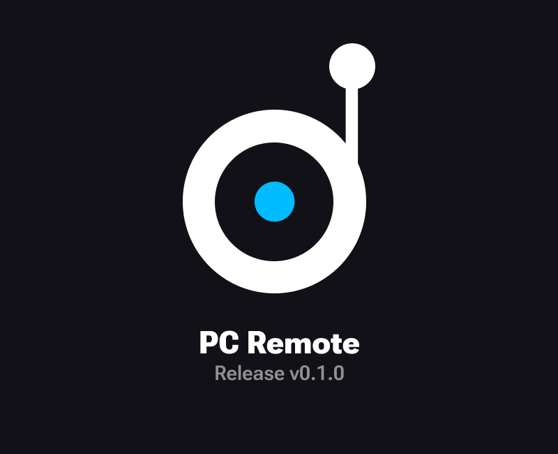
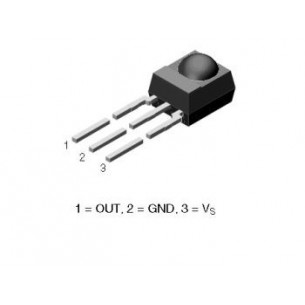
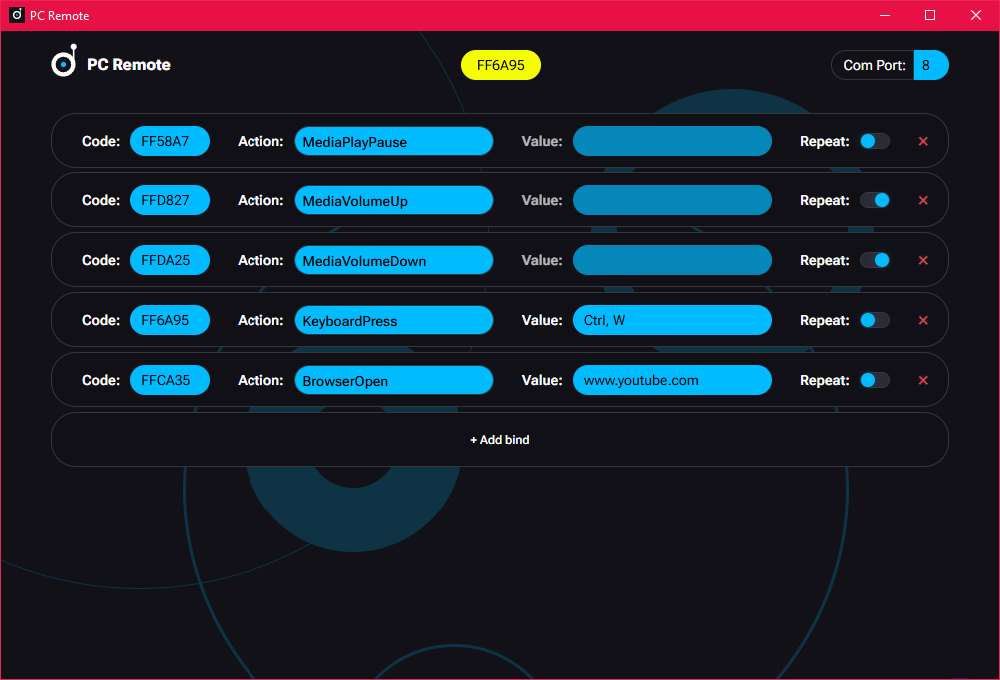

# PC Remote

PC Remote — это система дистанционного управления компьютером на базе микроконтроллера Arduino Nano и ИК-приёмника TSOP4838. Плата Arduino считывает сигналы от стандартного ИК-пульта. Приложение на вашем ПК, написанное на Rust, принимает эти сигналы через COM-порт платы и выполняет заданные пользователем действия.

Программа предоставляет графический интерфейс для управления привязками кнопок, назначения действий и настройки поведения. В приложении также необходимо указать номер COM-порта для платы Arduino.

> **Скачать для Windows**: [Release v0.1.2](https://github.com/fuderis/pc-remote/raw/main/pc-remote-win64.zip)

## Возможности:

* **Управляйте ПК** с любого ИК-пульта
* **Гибкие привязки**: назначайте любые действия на кнопки пульта
* **Удобный интерфейс**: все настройки и привязки — визуально
* **Кроссплатформенность**: работает там, где поддерживаются Rust и Arduino Nano

## Начало работы:

### 1. Подключение ИК-приёмника к Arduino Nano

Подключите TSOP4838 к Arduino Nano следующим образом:

* *VCC* (приёмник) → *5V* (Nano)
* *GND* (приёмник) → *GND* (Nano)
* *OUT* (приёмник) → *D2* (Nano)

> Убедитесь, что все соединения надёжны и изолированы.

### 2. Прошивка Arduino Nano

1. Скачайте и установите [Arduino IDE](https://www.arduino.cc/en/software/).
2. Установите библиотеку '**IRremote**' (__*2.6.0* - *2.8.0*__).
3. Откройте скетч из [/sketch в моём репозитории](https://github.com/fuderis/pc-remote/tree/main/sketch).
4. Подключите Arduino Nano к ПК через USB.
5. Выберите нужную плату и COM-порт в Arduino IDE.
6. Загрузите скетч на Arduino Nano.

### 3. Загрузка программы PC Remote

1. Скачайте последнюю версию [PC Remote](https://github.com/fuderis/pc-remote/raw/main/pc-remote-win64.zip).
2. Распакуйте архив в удобное место на ПК и установите программу.
3. Запустите исполняемый файл для старта интерфейса.
4. **Как добавить программу в автозапуск?**:
    * **Откройте планировщик задач**: нажмите сочетание клавиш `Win + R`, введите `taskschd.msc` и нажмите `Enter`.
    * **Создайте новую задачу**: установите для нее режим запуска при входе в систему с наивысшими привилегиями и укажите исполняемый файл программы в качестве действия. Сохраните задачу.

### 4. Настройка привязок и действий

> При первом запуске укажите номер COM-порта, к которому подключён ваш Arduino Nano (например: COM3).

Используйте графический интерфейс для добавления или редактирования привязок:

1. Нажмите кнопку на ИК-пульте для регистрации её кода.
2. Нажмите '*Add bind*', чтобы создать новую привязку с этим кодом.
3. Назначьте действие из списка.
4. Если доступно поле 'Value', заполните его:
    * *KeyboardPress*: введите названия клавиш через запятую
    * *BrowserOpen*: введите URL-адрес сайта
5. При необходимости включите повтор нажатия кнопки.

#### Доступные действия:

| Идентификатор	        | Описание                                                                                         |
| --------------------- | ------------------------------------------------------------------------------------------------ |
| KeyboardPress	        | Нажатие клавиш клавиатуры (одна или комбинация, включая Ctrl, Alt, Shift)                        |
| BrowserOpen	        | Открытие сайта по указанному URL в браузере по умолчанию                                         |
| MediaSwitchDevice	    | Переключение активного аудиоустройства (например, между колонками и наушниками)                  |
| MediaPlayPause	    | Воспроизведение/пауза медиаконтента                                                              |
| MediaNextTrack	    | Следующий трек                                                                                   |
| MediaPrevTrack	    | Предыдущий трек                                                                                  |
| MediaStop	            | Полная остановка воспроизведения                                                                 |
| MediaMuteUnmute	    | Включение/отключение звука системы                                                               |
| MediaVolumeUp	        | Увеличение громкости                                                                             |
| MediaVolumeDown	    | Уменьшение громкости                                                                             |
| MouseOnOff	        | Включение/выключение режима управления мышью с пульта                                            |
| MouseLeft	            | Движение курсора мыши влево                                                                      |
| MouseRight	        | Движение курсора мыши вправо                                                                     |
| MouseUp	            | Движение курсора мыши вверх                                                                      |
| MouseDown	            | Движение курсора мыши вниз                                                                       |
| MouseClick	        | Левый клик мыши                                                                                  |
| MouseScrollUp	        | Прокрутка вверх колесом мыши                                                                     |
| MouseScrollDown	    | Прокрутка вниз колесом мыши                                                                      |
| BrowserOpenNewTab	    | Открыть новую вкладку в браузере                                                                 |
| BrowserReopenTab	    | Восстановить последнюю закрытую вкладку                                                          |
| BrowserSwitchTab	    | Переключиться на следующую вкладку                                                               |
| BrowserCloseTab	    | Закрыть текущую вкладку                                                                          |
| BrowserHistoryBack	| Назад по истории браузера                                                                        |
| BrowserHistoryForward	| Вперёд по истории браузера                                                                       |
| BrowserBookmarkPage	| Добавить страницу в закладки                                                                     |
| BrowserZoomIn	        | Увеличить масштаб страницы в браузере                                                            |
| BrowserZoomOut	    | Уменьшить масштаб страницы в браузере                                                            |
| WindowsExit	        | Выйти из текущей сессии Windows                                                                  |
| WindowsSleep	        | Перевести компьютер в спящий режим                                                               |
| WindowsPowerOff	    | Выключить компьютер                                                                              |
| WindowsSwitchTab	    | Переключение между приложениями (аналог Alt+Tab)                                                 |

#### Поддерживаемые клавиши:

| Тип                   | Клавиша	                                                                                        |
| --------------------- | ------------------------------------------------------------------------------------------------- |
| Символы               | +, -, =, *, / и др.                                                                               |
| Стандартные           | A-Z, 0-9	                                                                                        |
| Функциональные        | F1-F12	                                                                                        |
| Модификаторы          | Ctrl, Alt, Shift, CapsLock, Win 	                                                                |
| Специальные           | Space, Enter, Backspace, Delete, Esc, Tab	                                                        |
| Мультимедиа           | PlayPause, PrevTrack, NextTrack, Stop, VolumeUp, VolumeDown, Mute                                 |
| Стрелки               | Left, Right, Up, Down                                                                             |

> Модификаторы можно комбинировать через запятую (например: Ctrl,Alt,Del).

## Решение проблем:

* **Нет сигнала**: проверьте подключение и выбранный COM-порт.
* **Кнопки не работают**: убедитесь, что используется правильный ИК-пульт и привязки настроены.
* **Программа не запускается**: проверьте наличие всех зависимостей и права доступа.

## Обратная связь:

Связаться со мной можно [здесь](https://t.me/fuderis), а также смотрите мой [канал](https://t.me/fuderis_club).
Буду рад вашим предложениям и отзывам!

> Copyright (c) 2025 _Bulat Sh._ ([fuderis](https://t.me/fuderis))
